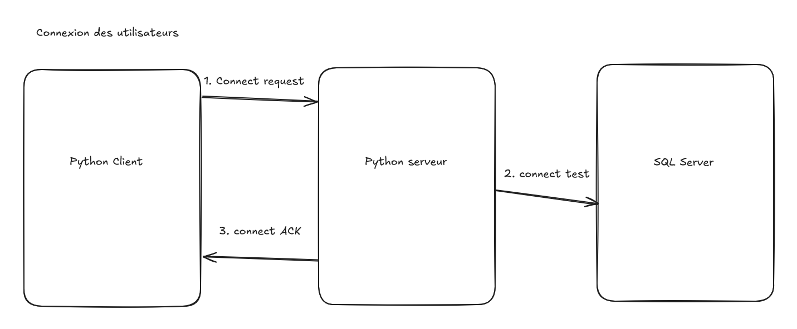

# Authentification

---

# Schéma de Principe

##  3 Composants:

* **__Python Client__** : Le livrable

  \
* Python Serveur : Qui fera office de proxy SQL afin que ce ne soit pas le client qui effectue directement les requêtes dans la base de donnée

  \
* SQL Server : qui fera office de stockage des taches, des utilisateurs et de tout ce qui tourne autour de l'application et des fonctionnalités

\

\

\

\

\

---

# Fonctionnement

## Serveur

## Client

---

# Sécurisation

La sécurisation passera par le hashage de mot de passe et par le Processus de Diffie Hellman (DH)

---

\

\